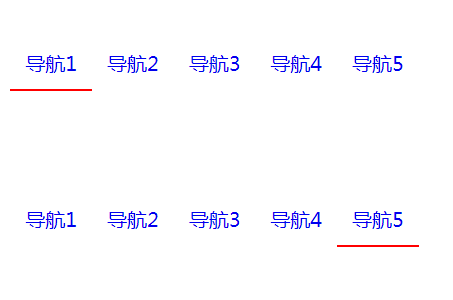

# jason-tail
> 有趣的导航小尾巴



## File include
```html
<script src="dist/Tail.umd.min.js"></script>
<script>
  /**
   *  @param { Object }       options
   *  @param { String | DOM } options.relativeEl            - 统一相对位置的父元素
   *  @param { String | DOM } options.itemEl                - 导航元素
   *  @param { String }       [options.event=click]         - 触发跟随事件名
   *  @param { Boolean }      [options.interesting=false]   - 有趣的模式
   *  @param { Number }       [options.defaultI=0]          - 默认下标
   *  @param { Object }       [options.tail]                - 尾巴属性
   *  @param { String }       [options.tail.className = ''] - tail 元素的 class
   *  @param { String }       [options.tail.color = #000]   - 尾巴颜色
   *  @param { String }       [options.tail.height = '2px'] - 尾巴高度
   *  @param { String }       [options.tail.duration = 255] - 尾巴高度
   **/
  new window.Tail(options)
</script>
```

## ES6
```bash
npm i --save jason-tail
```

```javascript
import Tail from 'jason-tail';

/**
 *  @param { Object }       options
 *  @param { String | DOM } options.relativeEl            - 统一相对位置的父元素
 *  @param { String | DOM } options.itemEl                - 导航元素
 *  @param { String }       [options.event=click]         - 触发跟随事件名
 *  @param { Boolean }      [options.interesting=false]   - 有趣的模式
 *  @param { Number }       [options.defaultI=0]          - 默认下标
 *  @param { Object }       [options.tail]                - 尾巴属性
 *  @param { String }       [options.tail.className = ''] - tail 元素的 class
 *  @param { String }       [options.tail.color = #000]   - 尾巴颜色
 *  @param { String }       [options.tail.height = '2px'] - 尾巴高度
 *  @param { String }       [options.tail.duration = 255] - 尾巴高度
 **/
let tail = new Tail(options);
```